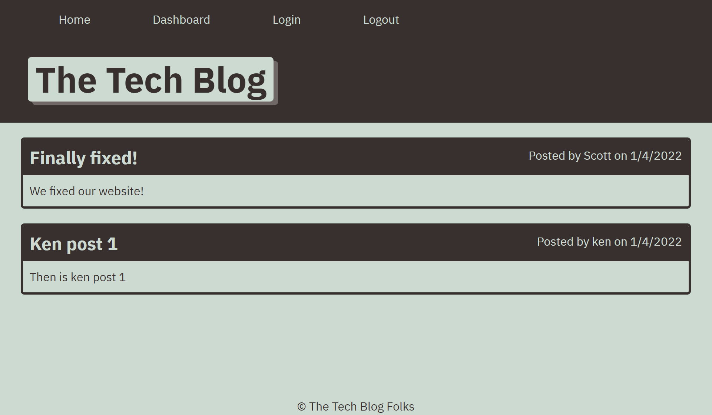

# The Tech Blog
## Description
Allows multiple to create accounts and add, edit and delete posts.
## Table of Contents
- [Installation Instructions](#installation-instructions)
- [Usage Information](#usage-information)
- [Contribution Guidelines](#contribution-guidelines)
- [Test Instructions](#test-instructions)
- [License](#license)
- [Questions](#questions)

## Installation Instructions
Use all the files as found in this repository: https://github.com/kencford/MVC-Tech-Blog
## Usage Information
Click on the Login tab to create an account with your personal Username and Password. The Home page shows all comments posted. The Dashboard shows your list of posts. You may select individual ones for updating or deleting. You may add a post by clickig on the "+ New Post" button.
## Contribution Guidelines
N/A
## Test Instructions
N/A
## License

## Questions
### Github account: www.github.com/kencford
### Email: Ken@mail.com